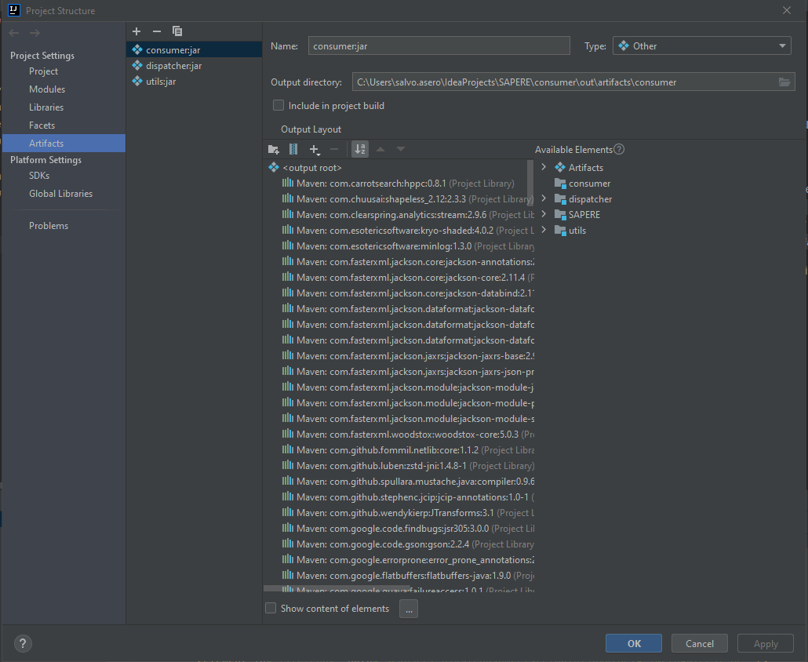
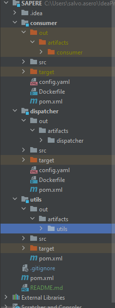

## Requirements
es, kafka, hadoop etc

## Project setup

### Jars

In order to start everything you need to build fat jars for each project (maybe there is a better way?).
To do this in IntelliJ Idea do the following:
1. File -> Project Structure
2. Click the plus symbol -> JAR -> From module with dependencies...
3. Select `Copy to the output directory and link via manifest`
4. Change the jar `Name` to the module name followed by :jar
5. Change the output path to `path/to/module/out/artifacts/module_name`

Repeat for each submodule, you should obtain something like this:

## How to run SAPERE

Make sure to do the following before you start SAPERE locally (using IntelliJ Idea):
1. Go to Build -> Build Artifacts... -> All Artifacts -> Clean
2. In the root folder type `mvn clean package`
3. Go to Build -> Build Artifacts... -> All Artifacts -> Build

Now you can start everything, but make sure to do it properly:
0. Create a new docker network
1. Start Kafka and Zookeeper: `./bin/kafka.sh`
2. Start Elastic Search and Kibana:`./bin/elastic.sh`
3. Start Hadoop and HDFS: `./bin/hadoop.sh`
4. Start the APIS: `./bin/api.sh`
5. Start the Dispatcher: `./bin/dispatcher.sh`
6. Start Jero consumer: `./bin/consumer.sh`